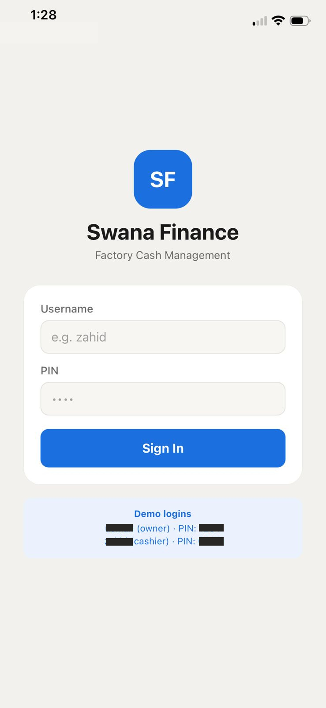
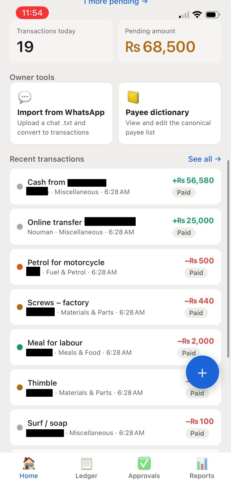
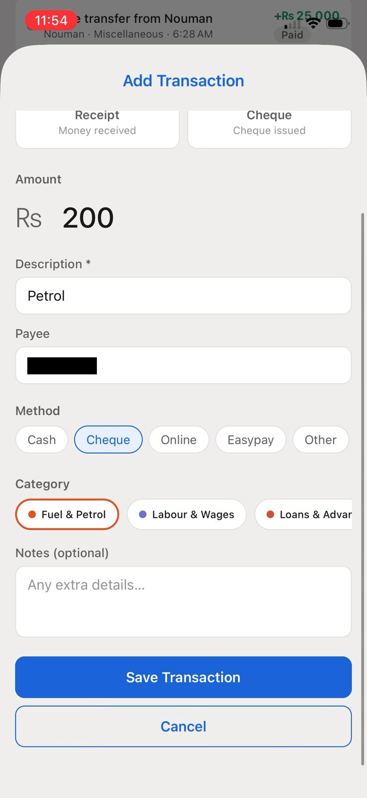
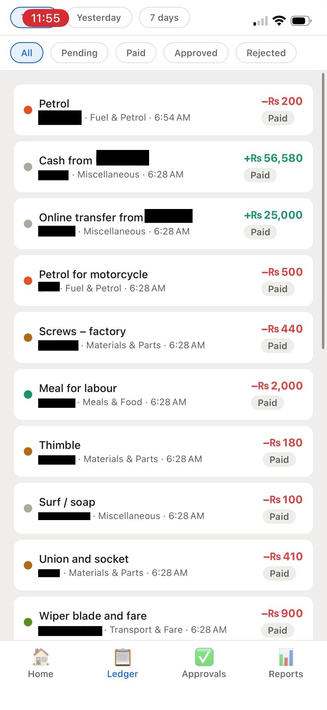
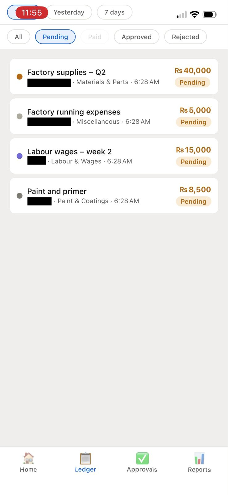
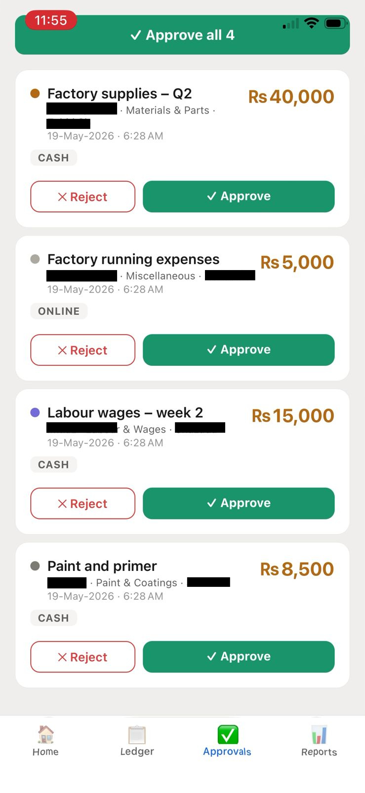
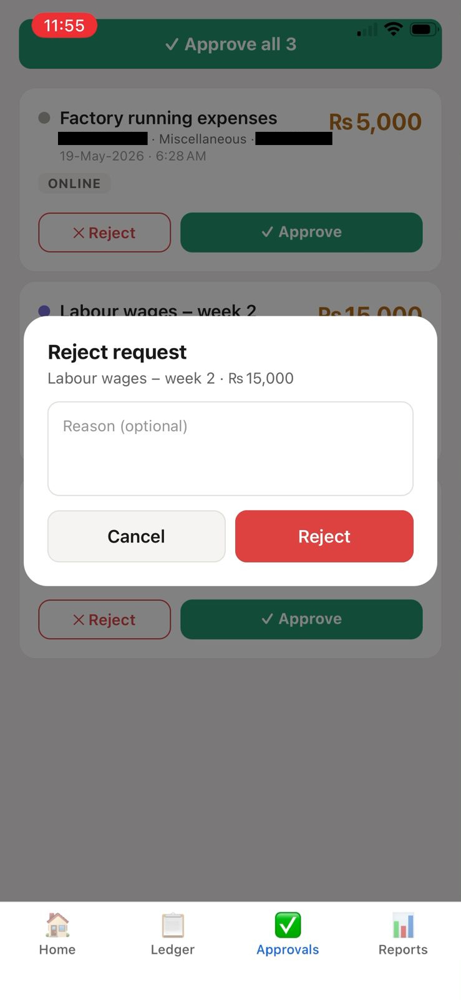
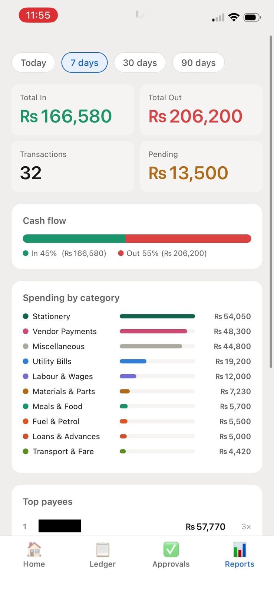

# Swana Finance Management System

A full-stack finance management system built for small-to-medium businesses. Manages daily transactions, approvals, expense tracking, and financial reporting — with a unique WhatsApp chat import engine that turns informal finance group messages into structured ledger entries.

---

## Screenshots

<table>
  <tr>
    <td align="center"><b>Login</b></td>
    <td align="center"><b>Dashboard</b></td>
  </tr>
  <tr>
    <td></td>
    <td></td>
  </tr>
  <tr>
    <td align="center"><b>Add Transaction</b></td>
    <td align="center"><b>Ledger — All</b></td>
  </tr>
  <tr>
    <td></td>
    <td></td>
  </tr>
  <tr>
    <td align="center"><b>Ledger — Pending</b></td>
    <td align="center"><b>Approvals</b></td>
  </tr>
  <tr>
    <td></td>
    <td></td>
  </tr>
  <tr>
    <td align="center"><b>Reject Dialog</b></td>
    <td align="center"><b>Reports</b></td>
  </tr>
  <tr>
    <td></td>
    <td></td>
  </tr>
</table>
---

## Features

### Core Finance
- **Dashboard** — live balance summary across cash, bank, and cheque accounts
- **Transaction management** — record payments, receipts, cheque outflows, and inter-account transfers
- **Approval workflow** — cashiers submit transactions; owner approves or rejects with reasons
- **Category tracking** — tag every transaction (salaries, utilities, transport, supplies, etc.)
- **History & filters** — filter by date range, type, status, category, or payment method

### Reports
- Daily, weekly, and monthly summaries
- Expense breakdown by category
- Account-wise balance history
- Pending approvals report

### WhatsApp Import Engine
A zero-dependency NLP-style parser that ingests exported WhatsApp group chats and converts informal messages into structured transactions:
- Recognises payee names with fuzzy matching and spelling-variant clustering
- Auto-categorises transactions using a learned keyword dictionary
- Flags low-confidence rows for manual review before committing
- Deduplicates on re-import using message hashing
- Fully explainable — no black-box ML, pure regex + clustering logic

### Payee Dictionary
- Visual editor for the payee knowledge base
- Merge, split, rename, or delete payee clusters
- Changes persist and immediately improve future imports

---

## Tech Stack

### Backend
| Layer | Technology |
|---|---|
| Runtime | Node.js 20+ |
| Framework | Express 4 |
| Database | SQLite (`better-sqlite3` v12) |
| Auth | JWT + bcrypt PIN login |
| Security | Helmet, CORS, rate limiting |
| Dev server | Nodemon |

### Frontend
| Layer | Technology |
|---|---|
| Framework | React Native + Expo SDK 54 |
| Navigation | React Navigation 7 |
| State | Zustand |
| HTTP | Axios |
| Platforms | iOS, Android, Web (single codebase) |

---

## Project Structure

```
swana-phase3-final/
├── swana-backend/
│   ├── src/
│   │   ├── routes/          # Auth, transactions, reports, categories, import
│   │   ├── models/          # DB query logic
│   │   ├── middleware/       # JWT auth, validation
│   │   ├── import/          # WhatsApp parser, fuzzy clusterer, category learner
│   │   └── server.js        # Express entry point
│   ├── database/
│   │   ├── schema.sql       # Full DB schema
│   │   └── seed.js          # Demo data seeder
│   ├── knowledge/
│   │   ├── payees.json      # Learned payee dictionary
│   │   └── categories.json  # Category keyword mappings
│   └── config/db.js         # SQLite connection
└── swana-frontend/
    ├── src/
    │   ├── screens/         # Dashboard, History, Reports, Import, Approvals
    │   ├── components/      # Reusable UI components
    │   ├── navigation/      # Stack + tab navigator
    │   ├── store/           # Zustand auth + tx stores
    │   ├── api/             # Axios API clients
    │   └── utils/           # Formatting, theme, storage helpers
    └── App.js
```

---

## Getting Started

### Prerequisites
- Node.js 20 or newer
- Expo Go app on your phone (for mobile testing)

### 1. Clone the repo
```bash
git clone https://github.com/MaheenAsif22/swana-finance-portfolio.git
cd swana-finance-portfolio
```

### 2. Start the backend
```bash
cd swana-backend
npm install
cp .env.example .env          # Windows: copy .env.example .env
# Edit .env — set JWT_SECRET to any long random string
npm run seed
npm run dev
```
Backend runs at `http://localhost:3001`

### 3. Start the frontend
```bash
cd swana-frontend
npm install
cp .env.example .env          # Windows: copy .env.example .env
# For browser: EXPO_PUBLIC_API_URL=http://localhost:3001
# For phone:   EXPO_PUBLIC_API_URL=http://YOUR_LOCAL_IP:3001
npm start
```
Press `w` to open in browser, or scan the QR with Expo Go.

### 4. Demo credentials
| Username | PIN | Role |
|---|---|---|
| `admin` | `1234` | Owner |
| `cashier1` | `0000` | Cashier |
| `cashier2` | `0000` | Cashier |

---

## API Endpoints

| Method | Endpoint | Description |
|---|---|---|
| POST | `/api/auth/login` | PIN login, returns JWT |
| GET | `/api/transactions` | List transactions (filterable) |
| POST | `/api/transactions` | Create transaction |
| PATCH | `/api/transactions/:id/approve` | Approve transaction |
| PATCH | `/api/transactions/:id/reject` | Reject transaction |
| GET | `/api/reports/summary` | Financial summary |
| GET | `/api/categories` | List categories |
| POST | `/api/import/parse` | Parse WhatsApp chat |
| POST | `/api/import/commit` | Commit parsed transactions |
| GET | `/api/health` | Health check |

---

## Role-Based Access

| Feature | Owner | Cashier |
|---|---|---|
| View dashboard | ✅ | ✅ |
| Submit transaction | ✅ | ✅ |
| Approve / reject | ✅ | ❌ |
| View all reports | ✅ | ❌ |
| WhatsApp import | ✅ | ❌ |
| Payee dictionary | ✅ | ❌ |

---

## Database Schema

Key tables: `users`, `transactions`, `categories`, `accounts`, `daily_balance`, `import_jobs`

Transactions support: `payment`, `receipt`, `request`, `cheque_out`, `transfer`

Statuses: `pending → approved / rejected / paid`

---

## Developed By

**Maheen Asif**  
Air University, Islamabad  
233103@students.au.edu.pk
